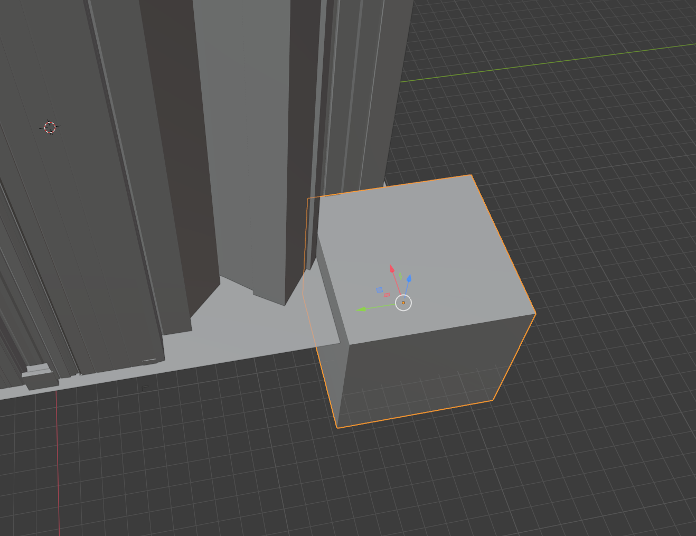

# Obj2Nav2

Converts arbitrary wavefront .obj files to MGSV compatible .nav2 files.

## Usage

`Obj2Nav2.exe Path\to\mesh.obj`

A file called `output.nav2` will be created in the current working directory.

## Guidelines

The provided mesh should use the same scale and co-ordinate space as the map you are working on (i.e. the in-game co-ordinates should map directly to the .obj). If you have a `.geoms` file for the map, it can be helpful to use https://github.com/oldbanana12/GeomsParser to create an obj of some of the map geometry and then use that to build your navmesh around.

Provided meshes should be as simple as possible in terms of edge count. The application does its own subdivision of the mesh to produce the necessary data structures for the .nav2 file.

## Example Workflow

The following steps detail how to make an .obj file with Blender that is compatible with "Obj2Nav2" for the "cuba" MGO map.

1. Use https://github.com/oldbanana12/GeomsParser to create an .obj file of `cuba_common_path_fox2_0_geoprim_win.geoms`. This isn't a necessary part of the process. However, since this file includes the boundaries of the map and is the right scale and position, we're going to use it as a guide to create the navmesh. It also contains some of the collidable geometry that we can also use as a guide to cut holes in the navmesh which the AI should navigate around.
   
2. Import the mesh you are using as a guide into Blender and switch into a top down view by clicking the blue "Z" gizmo in the top right. If necessary, bring your mesh into view by pressing <kbd>.</kbd> on the num pad.

3. Add a new plane by pressing <kbd>Shift</kbd> + <kbd>A</kbd> then selecting Mesh -> Plane. This will be inserted at the Origin. Use the Move and Scale tools from the sidebar on the left to scale up the plane and move it into position so that that covers the whole map. You may need to rotate the view a lot to make sure you can see all of the geometry. See the screenshot for an example:

4. Rotate the view and move the plane vertically until it is slightly below where you would expect the AI to stand/walk. **Note:** It is highly important that the Y coordinate of the AI entities spawn is greater than the Y coordinate of the navmesh it is expected to navigate on. You can check the coordinates of the mesh by pressing <kbd>N</kbd> to pop out the info panel, ensuring the "Item" tab is selected in that panel and then pressing "Global" to see the global coordinates. Note that Blender is Z-up, meaning that the Z co-ordinate in this window is representing the Y value that will be used by the game. In this example, I moved the plane to `Z = 27.38`. 
   
**Tip:** If the game is unhappy with the navmesh, it will spawn the enemy entities T-posed at 0,0,0. This generally happens when there isn't navmesh below where the game has been asked to spawn the enemy, or if the navmesh is above them.

5. Using the same methodology to create and position the plane, spawn in a cube and position it so that it intersects the plane in an area you want to remove. Enemies will navigate on parts of the plane that exist, so obstacles need to be cutouts in the plane. See below for a screenshot of positioning a cube to cut out part of the outer boundary of the map:

6. Select the plane again, either by left clicking it, or from the "Scene Collection" on the right hand side of the screen. Switch to the "Modifiers" tab (see screenshot):

7. Select "Add Modifier" and add a "Boolean" modifier. Ensure the operation is set to "Difference" and then use the eyedropper tool in the "Object" field to select the cube. You should see the shape of the plane's orange boundary change to indicate you have modified its shape. You can additionally hide this cube by clicking the "Eye" symbol next to it in the "Scene Collection" in the top right. See screenshot:

8. Repeat this process of adding cubes and modifiers to areas that you don't want to be navigable. Start with a small area and only a few cubes at first so you can test that the navmesh is working at all.

**Note:** You should make the cutouts around obstacles slightly bigger than the collider of the obstacle itself as the navmesh needs to account for the size of the enemy entity too.

**Note:** It is possible to move/scale/rotate any of the cubes you have already applied the boolean modifier to and still affect the mesh. So if you want to tweak things slightly, you can do it this way. If you "Apply" a modifier, it permanently affects the mesh, so it would be wise not to apply any of them until you're 100% happy.

9. See the screenshot below for an example of a basic plane:

(The red circle is where the enemies are set to spawn. When testing, I run to the black circle and get their attention and test that they can navigate towards the player via the blue lines.)

10. To correctly export the navmesh, ensure **only** the plane is selected, go to File -> Export -> .obj, and ensure that only the following checkboxes are selected (see screenshot for visual aid):
    - Selection Only
    - Objects as OBJ objects
    - Apply modifiers
    - Triangulate faces.

Once exported, run the resulting .obj file through Obj2Nav2 and add the resulting output.nav2 to your modded map and test. If things aren't working, you can always use https://github.com/oldbanana12/Nav2Parser to convert the .nav2 back to .obj and check that things haven't been messed up visually.

11.  Save the blender project in its native .blend file format as-is with none of the modifiers applied. That way, you can load the project again, make cubes visible, tweak them, and export again. If you "Apply" a modifier from within the modifiers tab, or only save the .obj, then you're stuck with a permanently modified plane that cannot be easily changed.

## Final Tips

It takes a lot of trial and error to get a navmesh that works well. If enemies aren't spawning where you expect, check that your navmesh Y coordinate (Z in blender) is below the Y coordinate of where you have specified the enemies should spawn and check that there is navmesh below where you have specified they should spawn. Remember that the coordinate system is flipped in Blender in all sorts of ways compared to the game!

If the enemies are spawning where they are supposed to but seem to be stuck playing the "frustrated" animation, make sure that there aren't any obstacles in your navmesh near to their spawn. They seem to need a relatively clear surrounding area at spawn.

In the examples folder of this repository, I have added the .blend and .obj files built for this example along with a Snakebite .mgsv that correctly loads the resulting .nav2 into the Cuba level. Some of the textures are a bit messed up, but this is unrelated to the nav2.